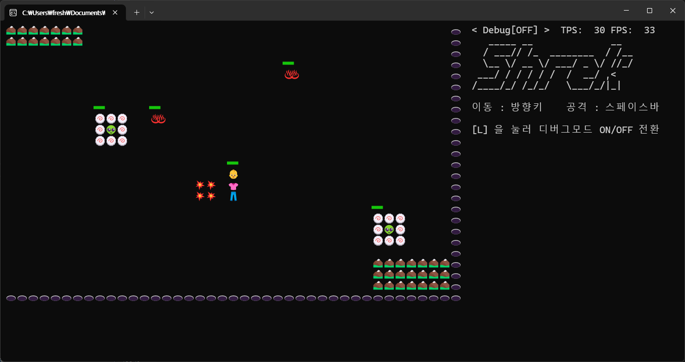

## 간단한 핵앤슬래시 게임

게임이름 : **Shrek**  

무기를 선택하고, 대량의 적들을 물리치는 콘솔게임 프로젝트.  

## 기간

2026년 01월 08일 ~ 2026년 01월 12일 (5일간)

## 목적

- Unity에 입문하기 전, 게임엔진의 프레임워크구조를 대략적으로 이해하고, 게임을 직접 만들어본다.

- 이를 통해, 게임 내부 구조의 설계 이유를 어느정도 공감하고, 앞으로 더 고성능의 게임을 제작하는데 도움이 되길 바란다.

## 핵앤슬래시 선택이유

다음 4가지 조건들을 세웠다.

1. 혼자, 단기간에 만들 수 있어야 한다.

2. 맵이 없거나, 맵의 영향을 많이 받지 않는다.

3. 프레임에 변화를 줄 때, 영향을 체감할 수 있어야 한다.

4. 최소한의 게임성과 완성도를 챙기면서, 플레이타임 10분이상 보장해야 한다.

  

최대한 단순한 맵에서, 로그라이크 요소가 없는 핵앤슬래시는 단기간 내에 만들어볼 수 있겠다고 생각했다.  

추후에, 기능 추가해볼만 점들이 많아서, 객체지향의 유지보수적인 장점도 느껴볼 수 있을 거 같다.

  

## 프로젝트 구조
### Managers
- SceneManager : 프로젝트의 모든 Scene을 관리
- ObjectManager : 프로젝트 내 모든 오브젝트를 관리
- InputManager : UserInput관련
- TimeManager : 게임에 필요한 시간들을 처리
- ConsoleManager : 나름의 더블버퍼링
### Objects
- BaseObject
- BaseObject를 상속받는 각종 컨텐츠 오브젝트들
### Scenes
- BaseScene
- BaseScene을 상속받는 각종 컨텐츠 씬들
### Utils
- Log : 로그관리
- Pos : 좌표관리
- ICollision : 충돌처리  
- Sprite : 객체의 외형 표현


```csharp
// SceneManager.Run()
public static bool Run()
{
    if (_quitRequested) return false;

    ProcessSceneConversion();

    InputManager.Poll();

    while (TimeManager.IsUpdateTime())
    {
        ObjectManager.Update();
        TimeManager.AddLogicCount();
    }

    ObjectManager.Render();
    TimeManager.AddFrameCount();

    return true;
}
```
위의 코드는 내가 만든 게임의 루프이다.   
간략하게 설명을 추가하자면,
게임 내의 **모든 Object**는 **ObjectManager**에 의해 관리된다.  
**Scene**의 역할은 오직 Object의 **배치**이다. 나머지는 Object들이 알아서 한다.  
**SceneManager**는 다른Manager들과 소통(?)하며 현재 실행될 Scene을 관리한다. 프로그램의 전체적인 관리자 느낌이다.    
**TimeManager**는 Object들의 로직 과 렌더링에 필요한 시간을 관리한다.  
*InputManager는 입력된 키 관리를 위해 만들었으나 별로 필요없는 듯하다. GetAsyncKeyState()쓰면 알아서 다 되더라.*


## 개발 중 헤맸던 점들

- **특정 Scene을 요청하면, 해당 Type에 맞는 Instance를 생성하는 기능이 필요했다.**

방법이 안떠올라서 찾아보고 아래처럼 구현했다.  
`제네릭 T로 클래스를 받고, Type변수에 typeof(T)를 담는다. Activator.CreateInstance(변수)로 instance를 만들어주었다.`  
정리하는 단계에서 `Type`을 공부하고 보니.. 그럴 필요가 전혀 없었다.
그냥 제네릭 `T`의 `where`조건으로 `new()`만 넣어주면 new생성 할 수 있었다.
T의 디폴트생성자 조건만 달아주면 컴파일러가 컴파일할 수 있게되고, 그러면 `T`는 치환되니 `new`로도 생성할 수 있는 것이다.

- **충돌처리 대상의 범위를, 모든 Object로 할 것이냐, 충돌가능한 Object만 할 것이냐.**

처음엔 Object에 충돌가능여부의 `bool`Flag를 두려했으나...
한 영역내에서 N개의 Object를 충돌처리하려면 Object에 N(N+1)/2 번 접근해야한다. 
이상황에서 flag를 체크하려면 N = 모든Object의 수 가된다.

그래서 `ICollision` 이라는 충돌가능을 뜻하는 인터페이스를만들고, 충돌가능한 클래스는 `ICollision`을 구현하도록 했다.

나쁘진 않은데.. 만들고 보니 flag변수 하나 두는 거랑 별차이가 없는 것 같다.
그리고 관리해야할 리스트가 하나 더 생긴다.
`allObjectList` , `ICollisionList`

더 좋은 방법이 있을 거 같은데, 실제 게임에서는 어떤 방식들을 사용하는시 찾아보고 정리해보겠다.

- **객체와 객체가 충돌했다고 판단하는 기준?**

모든객체가 원이나 정사각형같은 모양이면 쉽겠지만..
다양한 모양이라고 생각하니 내 머리에서 떠오르지 않았다.
검색해서 찾아낸 방법은 중학교?고등학교? 때 배웠던 수학이다.

두 도형의 중심사이의 거리를 X,Y축 따로 구한다.
두 도형이 접할 때 중심사이의 거리를 X,Y축 따로 구한다.
중심사이의 거리가 접할 때 길이보다 작으면 충돌했다고 할 수 있다.

근데 이것도 문제점이 있다. 도형이 상하대칭 + 좌우대칭이 아니거나.. 회전하고 있으면 어떡함??
실제게임에서는 객체의 모양이 복잡할텐데 어떻게 작동하는거지..
이것도 공부하고 다시 정리해보겠다.

- **좌표계 혼동**  

게임에서의 좌표에 대한 개념이 너무 부족했고, 규칙을 정하지 않았다.
이것때문에 위치계산할 때마다 너무 헷갈렸다.

1. 게임 내 실제좌표랑 콘솔화면에서의 SetCursurposition()에 필요한 정수와의 관계
2. 콘솔화면에서 x축1칸 과 y축1칸의 길이가 다른문제
3. SetCursurPosition()에서의 (0 , 0)은 격자의 중점인가, 면의 중점인가
4. 크기가 있는 객체의 위치를, 객체의 중심으로 할 것인가, 왼쪽상단 모서리로 할 것인가

이런 문제에 대한 규칙들을 정하지 않다보니, 내가 짠 코드인데 내가 어려운 상황에 이르렀다.
그래서 규칙을 확실히 정했다.

콘솔이 하나의 문자를 그릴 때 X축을 Y축의 절반만큼 사용하므로, 게임내 실제좌표를 **출력**할 때만
X축의 좌표를 2배 늘리기로 했다.
게임실제좌표에서 (0,0)은 콘솔화면 첫번째글자의 중심을 나타내는 것으로 했고, 오른쪽방향이 +X방향 아래방향이 +Y방향으로 정했다. 객체의 중심을 객체의 좌표로 정했다.

- **어디까지가 Logic이고, 어디까지가 Render인가**  

게임을 플레이할 때 FPS출력하는 것이 멋있어보여서 관련개념들을 공부했다.  
이해가 안갔던 부분이 몇가지 있는데.. 가령 컴퓨터의 성능이 좋아서 Render가 Logic보다 많이 돌아간다고 치자.  
Update#0 때 A객체의 X좌표는 0이였고, Update#1일 때, X좌표는 10이였다.
그러면 Update#1 이후에 호출되는 Render에서는 X : 0~10 까지의 이동과정을 그리는 것인가? 아니면 X: 10에서부터의 이동과정을 그리는 것인가?  
전자라면 Update의주기만큼 느리게 해당 화면을 보게되고, 후자라면 아직 확정나지 않은 캐릭터의 움직임을 그려줘야 한다. 이것 이외에 다양한 문제들을 고민하느라 시간을 많이 썼다.  
결국 현재 프로젝트에서 내가 택한 방식은 Update마다 현재위치와 방향만 기록하는 것이다. 아까의 예시라면 X가 증가하는 방향인 것이다.
그럼 다음Update에서 현재위치를, 이전Update때의 위치 + (속력 * 방향 * 이전Update후 흐른시간)으로 갱신해준다.
이런 방식을 적용하면 Render는 Update시의 위치 + (속력 * 방향 * 직전Update후 흐른시간)으로 그려줄 수 있다.
결과적으로 Update에서 실제위치와 방향을 갱신시켜주고 Render는 그당시의 흐른시간만큼 Player의 위치를 예상해서 그려줄 수 있다.


## 플레이 화면




## 잘했다고 생각하는점
- 콘솔게임이지만 **위치좌표를 소수**로 설정해서, 콘솔환경이 아닌 다른 환경으로 이식하더라도 일반적인 2D게임처럼 작동할수 있게 만들었다.
- **FPS개념**을 넣어서, 성능이 낮으면 적게 출력하고 성능이 높으면 많이 출력한다. 물론, 로직은 설정한 고정주기로 작동한다.
- 모든 코드를 작성할 때 **확장성**을 최대한 고려하면서 작성했기 때문에, 컨텐츠 추가가 쉽다. (실제로 컨텐츠 추가에는 시간이 많이 들지 않았다.)
- 최대한 **객체지향**의 방향을 살리고 싶어서, 게임 내 모든 것을 Object로 만들고, 전부 Object Manager가 관리하게 했다.

## 좋았던 점
단기간이지만 며칠동안 몰입해서 게임을 완성했다는 것 자체가 나한테 뿌듯하다.
지금까지 학습했던 내용들을 넓게 복습하는 느낌을 받았다.
전략도 좋았다.
욕심을 버리고, 컨텐츠들을 붙일 수 있는 구조를 만드는데 집중했다.
최소한의 기능만 완성해놓은 다음, 나중에 컨텐츠를 하나씩 추가하자는 식이었는데, 
그래서 기간내에 완성할 수 있었던 것 같다.

## 아쉬웠던 점
최대한 설계 때 부터 클래스를 나눈다고 나눴지만,
밀접하게 묶인 클래스들이 여러개 있는게 좀 아쉽다.
클래스단위로 분리해서 각각 재사용할 수 있는 클래스가 많지 않다.

**또, 처음 설계와 달리 객체지향이 조금씩 깨진 부분도 많고, 하드코딩스러운 코드도 꽤 있다.**

시간이 좀 지나고, 다시 내 프로젝트의 코드를 봐야 부족했던 점을 더 잘 알게될 거 같다.
지금은 하루종일 쳐다보니, 구조랑 구현코드가 머릿속에 들어와있어서 잘모르겠다.

## 마지막으로
프로그래밍은 아는 만큼 보이는 것 같다.  
앞으로 멀티스레드, 네트워크에 관해서 공부하고, 내 시야를 확장하고싶다.
